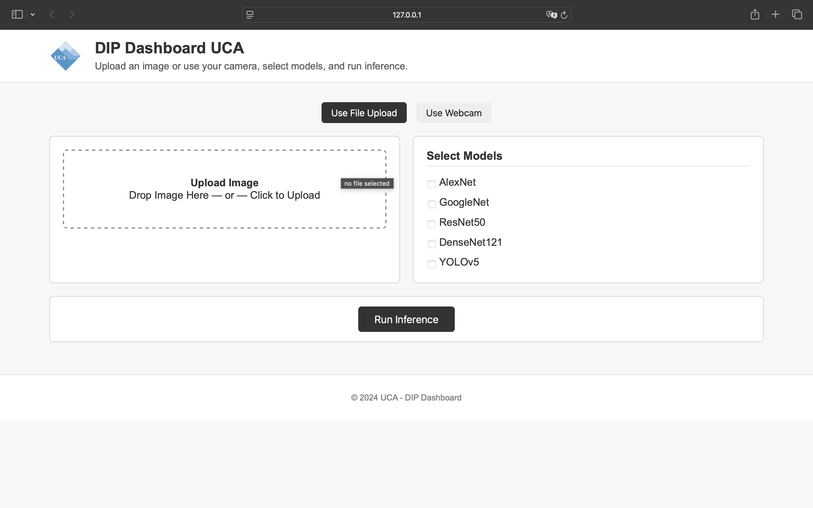

# DIP Dashboard UCA

A Django-based **Image Classification Dashboard** supporting multiple models like **AlexNet**, **GoogleNet**, **ResNet**, **DenseNet**, and **YOLOv5**. This dashboard allows users to upload an image, select models, and view predictions with confidence scores.

---

## Table of Contents
1. [Features](#features)
2. [How It Works](#how-it-works)
3. [Setup Instructions](#setup-instructions)
4. [Available Models](#available-models)
5. [Code Overview](#code-overview)
6. [Project Structure](#project-structure)
7. [Technologies Used](#technologies-used)
8. [Usage](#usage)
9. [Future Enhancements](#future-enhancements)

---

## Features

- **Image Upload**: Users can upload an image for classification.
- **Model Selection**: Supports **AlexNet**, **GoogleNet**, **ResNet50**, **DenseNet121**, and **YOLOv5**.
- **Real-Time Predictions**:
   - Top 5 predictions for classification models.
   - Object detection results for YOLO.
- **Interactive Dashboard**: Clean UI built with HTML, CSS, and JavaScript.

---

## How It Works

1. **User Upload**:
   - Upload an image using the dashboard interface.
2. **Model Selection**:
   - Select one or more models (AlexNet, GoogleNet, ResNet, DenseNet, YOLO).
3. **Processing**:
   - The uploaded image is preprocessed using PyTorch transforms.
   - Predictions are made using the selected models.
4. **Output**:
   - Top 5 class predictions (label and confidence) for classification models.
   - Detection results (class labels and confidence) for YOLO.

---

## Setup Instructions

### 1. Clone the Repository
```bash
git clone https://github.com/Ramzi-444/CNN_Architectures.git
cd image-dashboard2
```

### 2. Set Up Virtual Environment
```bash
python -m venv venv
source venv/bin/activate  # On Windows: venv\Scripts\activate
```

### 3. Install Dependencies
```bash
pip install -r requirements.txt
```

### 4. Download YOLOv5 Model
Place the **`yolov5su.pt`** file in the project root directory.

### 5. Database Migrations
```bash
python manage.py migrate
```

### 6. Run the Django Server
```bash
python manage.py runserver
```

Access the dashboard at **`http://127.0.0.1:8000`**.

---

## Available Models

| Model      | Description                          | Use Case                  |
|------------|--------------------------------------|---------------------------|
| **AlexNet**   | Classic deep CNN for image classification | Top-5 predictions          |
| **GoogleNet** | Inception-based deep learning model     | Efficient classification   |
| **ResNet50**  | Residual Network with 50 layers        | Accurate classification    |
| **DenseNet**  | Densely connected convolutional nets    | High accuracy in features  |
| **YOLOv5**    | Real-time object detection model       | Detects objects in images  |

---

## Code Overview

### Core Functions:
- **`transform`**: Image preprocessing using PyTorch transforms (resize, normalize).
- **`get_top5_outputs()`**: Fetches top-5 predictions for classification models.
- **YOLO Handling**: Processes YOLOv5 detections and extracts bounding boxes, labels, and confidence scores.

### Django Views:
```python
def index(request):
    return render(request, "index.html")

def classify_image(request):
    if request.method == "POST" and request.FILES.get("image"):
        # Handle uploaded image
        image = Image.open(request.FILES["image"]).convert('RGB')
        input_tensor = transform(image).unsqueeze(0)
        
        # Run models and return predictions
        selected_models = request.POST.getlist("models")
        results = {}
        if "ResNet" in selected_models:
            get_top5_outputs(resnet, input_tensor, "ResNet")
        # Repeat for other models...

        return JsonResponse({"results": results})
    return JsonResponse({"error": "Invalid request"}, status=400)
```

### Key Imports:
- PyTorch: `torch`, `torchvision`
- YOLO: `ultralytics.YOLO`
- Image Handling: `PIL.Image`
- Django: `render`, `JsonResponse`

---

## Project Structure

```bash
DIP_Dashboard/
├── classifier/               # Django app for model logic
│   ├── templates/            # HTML templates
│   ├── static/               # CSS, JS
│   ├── views.py              # Main logic for inference
│   ├── urls.py               # App URLs
│
├── image_dashboard/          # Main Django project
│   ├── settings.py           # Settings file
│   ├── urls.py               # URL configuration
│
├── venv/                     # Virtual environment
├── imagenet_classes.txt      # Class labels for ImageNet models
├── yolov5su.pt               # YOLOv5 pre-trained model
├── manage.py                 # Django management script
└── db.sqlite3                # SQLite database
```

---

## Usage

1. Visit the dashboard: **`http://127.0.0.1:8000`**.
2. Upload an image.
3. Select one or more models from the options:
   - AlexNet
   - GoogleNet
   - ResNet50
   - DenseNet121
   - YOLOv5
4. Click **"Run Inference"**.
5. View predictions with confidence scores.

---

## Technologies Used

- **Backend**: Django, PyTorch
- **Frontend**: HTML, CSS, JavaScript
- **Models**: AlexNet, GoogleNet, ResNet50, DenseNet121, YOLOv5
- **Image Processing**: Pillow (PIL)
- **Deployment**: Local Server (Django)

---

## Future Enhancements

- Add real-time webcam-based YOLO inference.
- Support multiple object detection models.
- Include advanced visualizations for bounding boxes.

---

## Contributors

- **Your Name** – Ramzi Abdulalishoev

---


## Screenshot 1


## Screenshot 2


## License

This project is licensed under the MIT License.
